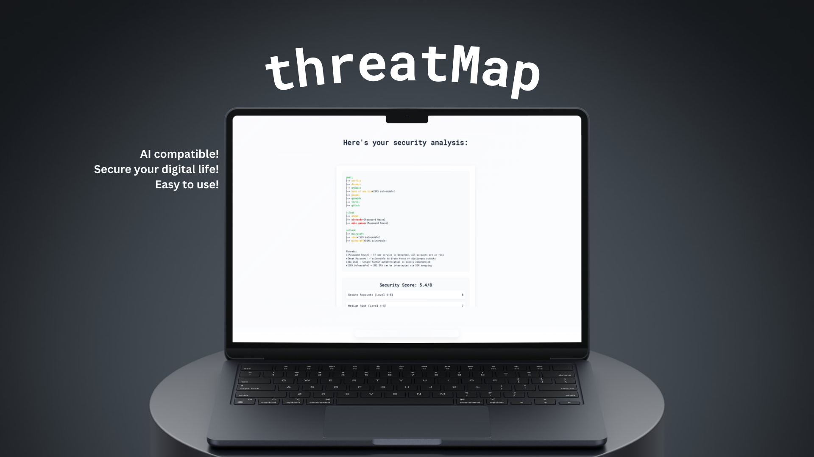

# threatMap

Digital security has become essential in our interconnected world, yet many people find it overwhelming to protect their online presence - threatMap bridges this gap by providing a simple, visual way to understand and improve your digital security posture.

threatMap is a minimalistic web tool that helps visualize and improve your digital security posture by mapping authentication methods across your connected accounts.

## Overview

threatMap helps you understand your digital security by:
- Mapping connections between your email accounts and connected services
- Evaluating authentication methods using the CASMM (Consumer Authentication Strength Maturity Model)
- Generating a visual security map with threat indicators
- Providing an exportable security assessment
- Creating AI-ready prompts for personalized security advice

## Features

- **Account Mapping**: Visualize relationships between primary accounts and connected services
- **Security Assessment**: Evaluate authentication methods on a scale of 1-8 using CASMM
- **Threat Visualization**: Clear indicators for security vulnerabilities
- **Progress Tracking**: Real-time progress bar during assessment
- **Export Options**: Save your security assessment as JSON
- **AI Integration**: Generate structured prompts for AI assistants

## CASMM Levels

1. **Shared Password**: Very risky, one breach affects all accounts
2. **Unique Password**: Weak but unique passwords
3. **Quality Password**: Strong but single-factor
4. **Password Manager**: Unique, strong passwords
5. **SMS 2FA**: Two-factor with SMS
6. **App-based 2FA**: Two-factor with authenticator apps
7. **Codeless 2FA**: Push notification authentication
8. **Passless**: Biometric/security key authentication

## Usage

1. Visit [threatmap.ashwath.ch](https://threatmap.ashwath.ch)
2. Enter your primary email accounts
3. List connected services for each account
4. Rate authentication methods
5. Review your security map and score
6. Export results or get AI assistance

## Development

threatMap is built with vanilla web technologies, focusing on simplicity and performance:

### Stack
- **Frontend**: Pure HTML, CSS, and JavaScript
- **Styling**: Custom CSS with CSS Variables for theming
- **Animations**: CSS transitions and keyframes
- **Storage**: Client-side only, no data persistence
- **Dependencies**: None - zero external libraries or frameworks

### Architecture
- `index.html`: Core HTML structure

CSS Structure:
- `css/core.css`: Base styles, variables, and animations
- `css/components.css`: Reusable component styles (buttons, inputs, cards)
- `css/style.css`: Layout and page-specific styles
- `css/visualization.css`: Threat map and security grid visualization styles

JavaScript Structure:
- `js/core/config.js`: Configuration, constants, and CASMM level definitions
- `js/core/store.js`: Central state management and data persistence
- `js/core/event.js`: Custom event system for component communication

Services:
- `js/services/accountService.js`: Account management and relationships
- `js/services/securityService.js`: Security level evaluation and scoring
- `js/services/vulnerabilityReport.js`: Threat analysis and reporting

Core Components:
- `js/threatMap.js`: Core threat mapping and visualization
- `js/mapper.js`: Account relationship mapping and tree generation
- `js/app.js`: Application initialization and component orchestration

### Key Features Implementation
- **Progress Bar**: CSS transitions with JavaScript state management
- **Security Grid**: CSS Grid with dynamic content generation
- **Account Map**: ASCII-style visualization with HTML/CSS
- **Notifications**: CSS-animated toast notifications
- **Export**: Native JavaScript Blob and File APIs

## 📝 License

This project is open-source and available under the [MIT License](https://opensource.org/licenses/MIT)  .

## Credits

Developed by [ashfelloff](https://github.com/ashfelloff)

